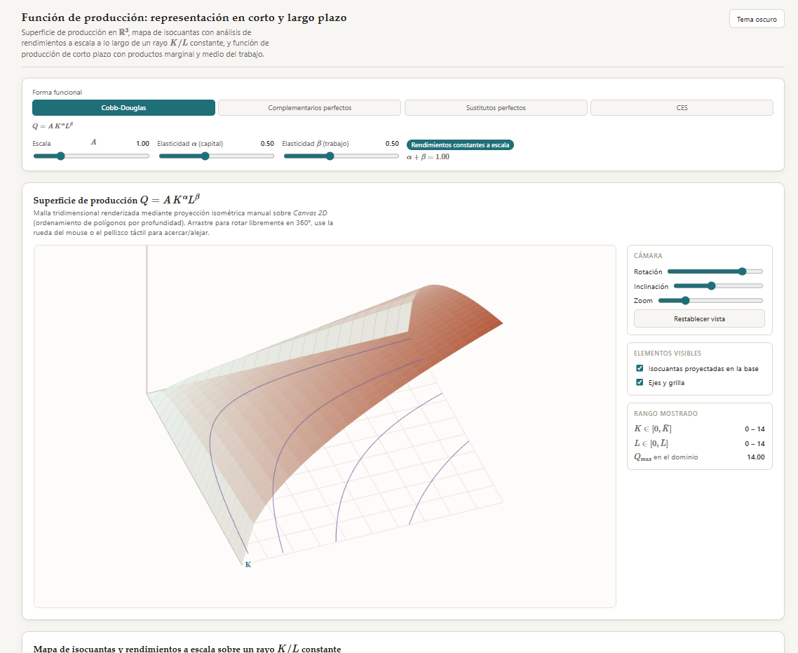

# Función de producción: representación en corto y largo plazo

Simulador interactivo, en un único archivo HTML autocontenido, para la enseñanza de la teoría de la producción en cursos de Microeconomía Intermedia de grado avanzado (Economía, Contador Público, Administración y Ciencias Sociales). Permite explorar la función de producción $Q(K,L)$ bajo cinco formas funcionales estándar, con tres paneles vinculados: la superficie tridimensional, el mapa de isocuantas con análisis de rendimientos a escala, y la función de producción de corto plazo con sus productos marginal y medio del trabajo.

No requiere instalación, compilación ni conexión a un backend: se abre directamente en el navegador o se incrusta como `iframe` en un aula virtual (Moodle u otra plataforma LMS).

**[▶ Abrir el simulador](https://fcontiggiani.github.io/produccion-cp-lp/produccion_cobb_douglas_3d.html)**

---

## Contenido pedagógico

### Formas funcionales disponibles

El simulador permite alternar entre cinco especificaciones de $Q(K,L)$ mediante un selector global, con parámetros libres compartidos entre los tres paneles:

| Forma funcional | Especificación | Parámetros libres |
|---|---|---|
| Cobb-Douglas | $Q = A\,K^{\alpha}L^{\beta}$ | $A$, $\alpha$, $\beta$ |
| Complementarios perfectos (Leontief) | $Q = A\,\min(\alpha K,\ \beta L)$ | $A$, $\alpha$, $\beta$ (coeficientes técnicos) |
| Sustitutos perfectos | $Q = A(\alpha K + \beta L)$ | $A$, $\alpha$, $\beta$ (ponderadores) |
| CES | $Q = A\left(\delta K^{\rho} + (1-\delta)L^{\rho}\right)^{\nu/\rho}$ | $A$, $\delta$, $\nu$, $\rho$ |
| Cúbica (sigmoidea, corto plazo clásico) | $Q = A\,K^{\alpha}(cL^2-L^3)$, válida en $L\in[0,c]$ | $A$, $\alpha$, $c$ |

Los controles de $\alpha$ y $\beta$ se reinterpretan dinámicamente según la forma activa (elasticidades en Cobb-Douglas, coeficientes técnicos en Leontief, ponderadores en sustitutos perfectos, participación distributiva $\delta$ y grado de homogeneidad $\nu$ en CES, o el parámetro $c$ que fija el dominio válido de $L$ en la forma cúbica), con rangos y etiquetas que se ajustan automáticamente al cambiar de forma.

La forma cúbica reproduce la función de corto plazo clásica de los manuales (Pindyck-Rubinfeld, Varian) para ilustrar las **tres etapas de producción con cruces interiores reales**: $PMg_L$ alcanza su máximo en $L=c/3$, $PMe_L$ se maximiza exactamente donde $PMg_L=PMe_L$ (en $L=c/2$), y $Q$ se maximiza donde $PMg_L=0$ (en $L=2c/3$). A diferencia de las demás formas, **no es homogénea en $(K,L)$ conjuntamente**, por lo que el concepto de rendimientos a escala no se le aplica (el simulador lo señala explícitamente donde corresponde).

### Panel 1 — Superficie de producción en 3D

Malla tridimensional de $Q(K,L)$ renderizada con proyección isométrica manual sobre *Canvas 2D* (sin librerías externas de gráficos 3D), con ordenamiento de polígonos por profundidad (*painter's algorithm*).

- **Rotación 360°** mediante arrastre del mouse o gesto táctil, **zoom** con rueda del mouse o pellizco, e inclinación regulable.
- Isocuantas proyectadas sobre la base del cubo, para relacionar visualmente la superficie con su mapa de curvas de nivel.
- El dominio de la malla ($K,L \in [0,14]$) coincide con el alcance máximo de las isocuantas de Leontief y sustitutos perfectos, y los ejes se extienden dinámicamente hasta ese límite cuando corresponde, evitando recortar el vértice de Leontief o la recta de sustitutos perfectos.

### Panel 2 — Mapa de isocuantas y rendimientos a escala

El análisis de rendimientos a escala exige mantener fija la *proporción* de factores $K/L$ y variar su cantidad conjunta; por ello el panel ancla la lectura sobre un **rayo de razón factorial constante**, con dos modos conmutables:

- **Modo 1 — Q en el rayo:** fija un punto $(K,L)$ de referencia sobre el rayo y muestra cómo cambia $Q$ en ese punto al variar la escala $A$ **y** al variar el propio grado de rendimientos a escala ($\alpha+\beta$ en Cobb-Douglas, $\nu$ en CES), perturbando el parámetro en $\pm 0.15$ y leyendo el efecto resultante sobre $Q$. En Leontief y sustitutos perfectos (rendimientos constantes por construcción) y en la forma cúbica (no homogénea en $(K,L)$), se indica que el concepto no aplica.
- **Modo 2 — Isocuantas fijas:** fija tres niveles de producto ($Q=0.5,\ 2,\ 8$) y muestra cómo se desplaza el punto $(K,L)$ necesario sobre el rayo para alcanzar cada nivel a medida que cambian los parámetros.

En ambos modos, el punto leído se proyecta con líneas punteadas sobre los ejes $K$ y $L$, con el valor de $Q$ etiquetado junto al punto.

### Panel 3 — Función de producción de corto plazo

Con el capital fijado en $\bar K$, se representa $Q(\bar K, L)$ en un subpanel superior y, debajo, el producto marginal $PMg_L=\partial Q/\partial L$ y el producto medio $PMe_L=Q/L$ del trabajo.

- El dominio de $L$ está acotado a $[0,3]$ para observar con detalle el comportamiento a bajos niveles de trabajo. En la forma cúbica, el rango del parámetro $c$ se limita a $[1,\,4.5]$ para que las tres etapas de producción queden siempre visibles dentro de ese dominio.
- Botón **"Fijar curva actual"**: superpone la curva $Q(\bar K,L)$ vigente (semitransparente, con su propio color) para comparar visualmente cómo se desplaza la función de corto plazo al cambiar $\bar K$, con hasta cinco curvas simultáneas y lista lateral editable.
- La clasificación de etapas de producción (Etapa I/II/III) se recalcula según la forma funcional activa: en Cobb-Douglas, la propiedad $PMg_L=\beta\cdot PMe_L$ hace que la etapa quede fijada globalmente por $\beta$ y no varíe con $L$; en Leontief, el quiebre en $PMg_L$ es real y corresponde al punto donde el capital pasa a ser el factor limitante; en sustitutos perfectos, $PMg_L$ es constante; en CES, la razón $PMg_L/PMe_L$ varía con $L$ de forma no trivial según $\rho$ y $\nu$; en la forma **cúbica**, las tres etapas coexisten en tramos reales y disjuntos de $L$ — con cruces exactos en $L=c/2$ (máximo de $PMe_L$) y $L=2c/3$ (máximo de $Q$, donde $PMg_L=0$).

### Sincronización de controles

Los parámetros de forma funcional, $A$, $\alpha/\delta$, $\beta/\nu$ y $\rho$ están disponibles **tanto en la barra superior como en el panel de isocuantas**, y ambos juegos de controles se mantienen sincronizados en ambas direcciones: modificar cualquiera de los dos actualiza el estado global y refleja el cambio instantáneamente en el otro.

---

## Notación

Se sigue la convención estándar de la literatura: $K$ para capital, $L$ para trabajo, $Q$ (o $Q(K,L)$) para el producto, $A$ para el parámetro de escala o productividad total de los factores. Las condiciones de primer orden y las derivadas parciales se presentan con notación $\partial Q/\partial L$ explícita donde corresponde.

---

## Requisitos técnicos

- Navegador moderno con JavaScript habilitado (Chrome, Firefox, Safari, Edge en sus versiones recientes).
- Conexión a internet únicamente para cargar **MathJax 3** (vía CDN, `cdnjs.cloudflare.com`), usado exclusivamente para el renderizado de expresiones matemáticas en las etiquetas de la interfaz. No se emplea ninguna librería externa de gráficos: toda la visualización (superficie 3D, isocuantas, curvas de corto plazo) se renderiza con **Canvas 2D nativo**.
- No requiere backend, base de datos ni proceso de compilación.

---

## Uso en el aula

Sugerencias de integración según el momento de la clase:

- **Introducción a la función de producción:** Panel 1, alternando entre formas funcionales para que el estudiantado visualice cómo cambia la geometría de la superficie (curvatura, aristas, planitud) según la forma elegida.
- **Rendimientos a escala:** Panel 2 en Modo 1, fijando un punto sobre el rayo y variando $\alpha+\beta$ (o $\nu$ en CES) para leer directamente el efecto sobre $Q$ sin cambiar la intensidad relativa de factores.
- **Comparación de niveles de producto bajo distintos $A$:** Panel 2 en Modo 2, observando cómo se desplazan hacia el origen las isocuantas de igual nivel cuando aumenta la productividad total de los factores.
- **Ley de rendimientos marginales decrecientes y etapas de producción:** Panel 3 con la forma **cúbica**, para mostrar las tres etapas completas con cruces interiores reales — a diferencia de Cobb-Douglas, donde la Etapa III nunca se alcanza. Complementar fijando distintos valores de $\bar K$ para comparar la familia de curvas de corto plazo.
- **Formas no homogéneas y límites del análisis de escala:** Panel 2, cambiando a la forma cúbica para mostrar por qué el concepto de rendimientos a escala no es aplicable a toda función de producción, y contrastar con las formas donde sí lo es.

---

## Licencia y uso

Material de uso educativo. Se autoriza su adaptación y reutilización con fines docentes, con atribución a la fuente.
